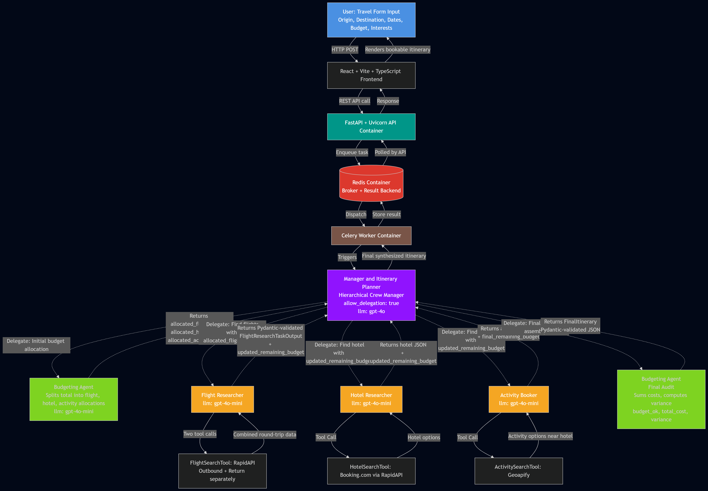

# Agentic AI Travel Planner 🌍✈️

A production-oriented multi-agent system powered by **CrewAI** that automates end-to-end travel planning. This system orchestrates 5 specialized AI agents in a hierarchical structure to decompose user intent, search real-time data, and generate bookable itineraries with strict budget adherence.

---

## 🧐 The Problem Statement

### 1. The Customer Friction

Planning a trip with real-world constraints is an exhausting, fragmented process. Users are forced to juggle multiple tabs, comparing flights, vetting hotels and researching activities while mentally calculating if everything fits their budget.

When users are forced to do this "heavy lifting" manually, two critical issues arise:

* **Missed Opportunities:** Users often miss out on high-demand accommodations ("hidden gems") and optimal flight paths simply because they cannot process the volume of data efficiently.
* **High Abandonment:** The sheer difficulty of coordinating logistics leads to **decision fatigue**, causing many users to stop planning entirely and abandon their trip.

### 2. The Business Opportunity

For Online Travel Agencies (OTAs), every minute a user spends planning on an external platform is a lost revenue opportunity. When users plan on generic AI chats and book components individually, the platform loses the chance to cross-sell and earn commissions on packages.

**Why this system wins:**

* **Increased AOV (Average Order Value):** By bundling flights, hotels, and activities into one valid "product", the system naturally encourages larger, higher-margin transactions.
* **Differentiation:** In a market of identical booking engines, offering a "concierge" experience becomes a massive competitive moat.

**The Solution:** By deploying an autonomous agent system that can deliver a complete, bookable travel package (Flights + Hotels + Activities) in under **2-3 minutes**, platforms can significantly increase conversion rates, retain customers, and capture full-lifecycle value.

---

## 🚀 The Solution: Hierarchical Multi-Agent Orchestration

I built a **CrewAI-based hierarchical architecture** that treats travel planning as a delegated workflow between specialized agents. A central Manager agent decomposes user intent and delegates research tasks to specialists. Unlike a standard chatbot, this system uses **Tool Calling** to interact with real-world APIs, ensuring that every suggestion is actually bookable and within budget.

### Key Features

* **Hierarchical 5-Agent Architecture:** A Manager agent orchestrates 4 specialists (Flight Researcher, Hotel Researcher, Activity Booker, Budgeting Agent) with explicit delegation authority.
* **Dual-Role Budgeting Agent:** The Budgeting Agent runs twice in the workflow: first to allocate the total budget across categories (flight, hotel, activity), then to audit the final assembled itinerary against the original budget.
* **Sequential Budget Propagation:** Each specialist passes `updated_remaining_budget` to the next, ensuring the system tracks budget consumption as the plan develops.
* **Adaptive Budget Flexibility:** The Flight Researcher can exceed its allocation if needed, provided 40% of the total budget remains for hotels and activities. This prevents rigid failures when allocations are too tight.
* **Pydantic Output Validation:** All inter-agent communication validated against strict Pydantic schemas (FlightResearchTaskOutput, FinalItinerary) to enforce structured outputs and deterministic agent behavior.
* **Async Architecture:** Celery + Redis for non-blocking task execution, enabling 1-3 minute agent runs without HTTP timeouts.

---

## 🛠️ Tech Stack

* **Orchestration:** CrewAI (Hierarchical Process)
* **Backend:** Python, FastAPI, Uvicorn (Server)
* **Async Processing:** Celery, Redis (Broker & Result Backend)
* **Frontend:** React, Vite, TypeScript, Lucide React
* **LLMs:** GPT-4o (Manager), GPT-4o-mini (Specialists)
* **Validation:** JSON Schema, Pydantic
* **External APIs:** RapidAPI (Flights), Booking.com via RapidAPI (Hotels), Geoapify (Activities)

---

## 🏗️ Architecture Overview

The system runs as a 3-tier architecture:

**Frontend Tier:** React + TypeScript form captures structured user input (origin, destination, dates, budget, interests).

**API Tier:** FastAPI receives requests and queues them through Celery + Redis for async processing. This decouples long-running agent execution from user-facing latency.

**Agent Tier:** A hierarchical CrewAI workflow where the Manager delegates tasks sequentially:

1. **Initial Budget Allocation:** Manager delegates to Budgeting Agent, which splits the total budget into flight, hotel, and activity allocations.
2. **Flight Research:** Manager delegates to Flight Researcher with `allocated_flight_budget`. Returns selected round-trip flights and `updated_remaining_budget`.
3. **Hotel Research:** Manager delegates to Hotel Researcher with the updated remaining budget. Returns selected hotel and updated remaining budget.
4. **Activity Planning:** Manager delegates to Activity Booker with the latest remaining budget. Returns selected activities and final remaining budget.
5. **Final Audit:** Manager delegates to Budgeting Agent again. Sums all actual costs, computes variance, asserts `budget_ok`, and assembles the FinalItinerary.



---

## 🔑 Key Technical Decisions

**Why hierarchical CrewAI process?** Unlike sequential processes where agents run in fixed order, hierarchical delegation lets the Manager re-plan if a specialist fails. If Hotel Researcher cannot find a hotel within budget, the Manager can re-delegate with adjusted constraints rather than crashing the whole crew.

**Why Celery + Redis?** Multi-agent execution can take 1-3 minutes. Synchronous HTTP would time out. Celery offloads the work asynchronously, and Redis serves as both the job broker and the result store.

**Why two LLM tiers (gpt-4o vs gpt-4o-mini)?** The Manager needs strong reasoning to handle delegation, replanning, and synthesis decisions, justifying gpt-4o. Specialist agents execute well-scoped tasks with structured outputs, so gpt-4o-mini is sufficient and significantly cheaper at scale.

**Why dual-role Budgeting Agent?** Running budget logic at both ends of the workflow gives the system upfront constraint setting AND end-state validation. Most multi-agent systems only validate at the end, which means budget violations are caught too late to prevent wasted tool calls.

**Why Pydantic schemas?** Tool inputs and outputs need strict validation to prevent agents from generating malformed API calls or hallucinated structures. Pydantic provides type safety and structured failure modes.

**Why three separate APIs (RapidAPI, Booking.com, Geoapify)?** Each domain has different data quality. Booking.com has the strongest hotel data, RapidAPI aggregates flight options, and Geoapify handles location-based activity searches.

---

## ⚠️ Known Limitations

* **Cost scaling:** GPT-4o calls cost approximately $0.05-0.10 per full itinerary generation. Production deployment requires caching and prompt optimization.
* **Edge cases:** Uncommon destinations or very tight budgets occasionally produce inconsistent agent reasoning, which is why the Manager has re-delegation authority.
* **API dependency:** Three external APIs introduce reliability risks. Fallback logic exists but partial results may occur during outages.
* **No persistent memory:** Each trip request runs independently; the system does not learn from previous user interactions.

---

## 🚀 Future Improvements

* RAGAS-based evaluation framework for measuring agent task accuracy
* Phoenix or LangFuse integration for token, latency, and cost observability
* User-specific preference memory across trip requests
* Caching layer for common destinations to reduce LLM costs
* Deeper integration with booking APIs for one-click reservations

---

## ⚡ Getting Started

### Prerequisites

* **System**: Python 3.10+, Node.js 18+, Docker Desktop
* **API Keys**: Groq (free — console.groq.com), RapidAPI (Booking.com), Geoapify

### Installation

#### 1. Clone the Repository

```bash
git clone https://github.com/aviralsoni22/agentic-travel-planner.git
cd agentic-travel-planner
```

#### 2. Configure Environment

Create a `.env` file in the `agentic_travel_planner` directory (backend) and add your keys:

```bash
# agentic_travel_planner/.env
GROQ_API_KEY=gsk_...            # free key from https://console.groq.com
RAPIDAPI_KEY=...
GEOAPIFY_KEY=...
SERPER_API_KEY=...
REDIS_URL=redis://travel_redis:6379/0  # compose service name; honored by worker.py
# Optional model overrides (defaults shown):
# GROQ_WORKER_MODEL=llama-3.3-70b-versatile
# GROQ_REASONING_MODEL=openai/gpt-oss-120b
```

Create a `.env.local` file in the `frontend` directory and add your key:

```bash
# frontend/.env
VITE_GEMINI_API_KEY=...
```

#### 3. Run Backend (Docker)

This project requires Docker to orchestrate the AI Agents, API and Redis (used for both message queuing and result storage).

```bash
# From the root directory
docker-compose up --build
```

Wait until you see "Application startup complete" in the logs.

#### 4. Frontend Setup (React)

Open a new terminal to run the UI:

```bash
# Navigate to frontend
cd frontend

# Install dependencies
npm install

# Run the dev server
npm run dev
```

Visit the link in the frontend terminal to start planning.

---

## 📄 License

MIT License - see LICENSE file for details.

---

## 👤 Built by

Aviral Soni · [GitHub](https://github.com/aviralsoni22) · [LinkedIn](https://linkedin.com/in/aviralsoni22)